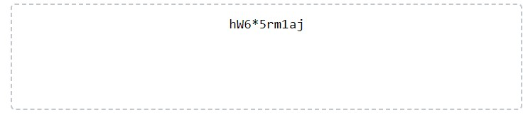

# Password Generator

## Description
Passwords are always a point of contention. Do you create the same password for multiple sites? Do you create a slightly different password for each site with a general password convention? Where do you think of your passwords? Are they secure enough? Look no further, the password generator will ask you what you're looking for and create a customzied password based your requested criteria. 

I learned that using Math.Random() alongside the Math.Floor() functions allow you to generate a lot of random values. Although I'm not quite there, I can only imagine how useful that is when creating educational material, games, and playful websites.

## Installation
There is no installation necessary. Please visit [this website](https://brigantinojoe.github.io/password_generator/) to generate your password.

## Usage
Please read the following instructions to use the Password Generator:
1) CLick the red "Generate Password" button at the bottom of the white text box.
2) Answer the promts provided by the console. Make sure to use a number instead of a word, the generator not create passwords with character lengths defined with a string.     
    
3) Answer the following promts, using the 'OK' as 'Yes' and the 'Cancel' as 'No' when answering what kind of characters should be included in the final password.
4) Copy your customized password and enjoy your newfounded security! The password will populate in the text bax with the dashed border as shown below:
